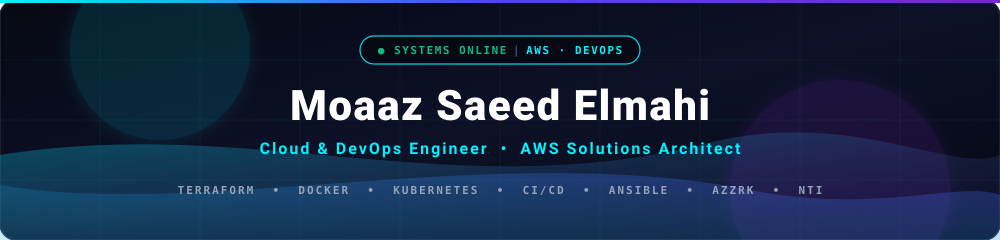

<div align="center">

<!-- Animated Header Wave -->
<a href="https://portfolio-v3-black-alpha.vercel.app/">
  
</a>

<!-- Dynamic Animated Typing SVG -->
<a href="https://portfolio-v3-black-alpha.vercel.app/">
  
</a>

<br/>

<!-- Action Navigation Pills -->
<p align="center">
  <a href="https://portfolio-v3-black-alpha.vercel.app/">
    
  </a>
  <a href="https://www.linkedin.com/in/moaaz-elmahi/">
    
  </a>
  <a href="mailto:moazelmahi39@gmail.com">
    
  </a>
  <a href="https://github.com/moaaz17877640">
    
  </a>
</p>

<!-- Interactive Quick Metrics -->
<p align="center">
  
  
  
  
  
</p>

</div>

---

### 🖥️ `$ whoami --verbose`

```yaml
engineer:
  name: "Moaaz Saeed Elmahi"
  title: "Cloud & DevOps Engineer"
  location: "Cairo, Egypt 🇪🇬"
  degrees: "B.Sc. in Information Technology, Tanta University (GPA: 3.6 / B+)"
  graduation_project: "SPIDERS for Security (Grade: A+)"
current_focus:
  primary_role: "DevOps Engineer @ Azzrk (Nov. 2025 - Present)"
  teaching_role: "Cloud Instructor (Part-time) @ NTI (National Telecommunication Institute)"
  mission: "Transforming complex infrastructure into predictable, declarative, automated code."
  live_portfolio: "https://portfolio-v3-black-alpha.vercel.app/"
stack_highlights:
  cloud: ["AWS", "Azure", "Hetzner", "OCI"]
  iac: ["Terraform", "Ansible", "Helm"]
  containers: ["Docker", "Kubernetes", "OpenShift"]
  ci_cd: ["GitHub Actions (Custom Action Author)", "Jenkins", "GitLab CI"]
```

---

## 🏆 Verified Cloud Credentials

<div align="center">

<table>
  <thead>
    <tr align="center">
      <th>Badge</th>
      <th>Certification</th>
      <th>Issuing Authority</th>
      <th>Verification Link</th>
    </tr>
  </thead>
  <tbody>
    <tr>
      <td align="center">
        
      </td>
      <td><strong>AWS Certified Solutions Architect – Associate</strong></td>
      <td>Amazon Web Services</td>
      <td>
        <a href="https://www.credly.com/badges/3bb149d1-8c80-4f83-b69e-2b0d36dd2e32">
          
        </a>
      </td>
    </tr>
    <tr>
      <td align="center">
        
      </td>
      <td><strong>AWS Certified Cloud Practitioner</strong></td>
      <td>Amazon Web Services</td>
      <td>
        <a href="https://www.credly.com/badges/eb3908da-2a6b-4710-9fe9-954a1b5c9936/linked_in_profile">
          
        </a>
      </td>
    </tr>
    <tr>
      <td align="center">
        
      </td>
      <td><strong>Oracle Cloud Infrastructure (OCI) 2024 Certified Foundations Associate</strong></td>
      <td>Oracle Cloud</td>
      <td>
        <a href="https://catalog-education.oracle.com/ords/certview/sharebadge?id=5BD86914A6262A377CBE961E491D630F4763C097864553EE3A15C5AA0FE3C590">
          
        </a>
      </td>
    </tr>
  </tbody>
</table>

</div>

---

## 💼 Professional Experience

### 🚀 **DevOps Engineer** — [Azzrk](https://github.com/moaaz17877640)
*Mansoura, Dakahlia, Egypt &nbsp;|&nbsp; Nov. 2025 – Present*

- **End-to-End CI/CD Automation:** Engineered and maintained automated build, test, and zero-downtime deployment pipelines using **GitHub Actions**, cutting deployment cycles and human error.
- **Idempotent Server Provisioning:** Automated staging and production multi-server fleets using **Ansible, Bash, and Python**, standardizing baseline configurations and hardening server environments.
- **High-Availability Cloud Architecture:** Managed scalable, fault-tolerant infrastructure on **AWS**, guaranteeing staging/production parity and 99.9% uptime.
- **FinOps & Security Governance:** Collaborated with cross-functional product teams to optimize cloud infrastructure spend, enforce least-privilege RBAC, and integrate automated security scans.

---

### 👨‍🏫 **Cloud Instructor (Part-time)** — [National Telecommunication Institute (NTI)](https://www.nti.sci.eg/)
*Egypt &nbsp;|&nbsp; Apr. 2025 – Dec. 2025*

- **Cloud Foundations & Architecture:** Delivered hands-on courses covering cloud computing architectures, cloud migration, and **IaaS, PaaS, SaaS** delivery models.
- **Practical Infrastructure Labs:** Led practical sessions covering compute (**EC2**), scalable storage (**S3, EBS**), VPC networking, security groups, subnets, and relational databases.
- **Certification Coaching:** Mentored over **100+ students and engineers** preparing for industry cloud certifications (AWS SAA & CCP) and production cloud engineering.

---

## 🚀 Featured Production Projects & Systems

<details open>
<summary><h3>1. 🔄 <strong>Jenkaz</strong> — Custom GitHub CI & Jenkins CD Bridge</h3></summary>

> **Tech Stack:** `GitHub Actions` &bull; `Jenkins` &bull; `CI/CD` &bull; `Bash` &bull; `REST APIs`

- Developed a custom **GitHub Action** bridging modern GitHub CI workflows with local private Jenkins CD execution pipelines.
- Engineered automated status verification polling Jenkins job results to act as automated deployment gates.
- Strict pipeline validation guarantees workflows automatically halt on failed deployment stages, preventing broken builds from reaching servers.
- Significantly accelerated cross-platform release validation with immediate feedback loops.

```
[Developer Push] ➡️ [GitHub Actions CI] ➡️ [Jenkaz Custom Action] ➡️ [Jenkins CD Job]
                                                 ⬇️
                              [Poll Job Status & Enforce Gate]
                                    ✅ Pass / ❌ Fail
```
</details>

<details>
<summary><h3>2. 🧪 <strong>Hurlaz</strong> — Declarative API & Security Testing in CI/CD</h3></summary>

> **Tech Stack:** `TypeScript` &bull; `GitHub Actions` &bull; `Hurl` &bull; `REST APIs` &bull; `HTTP Automation`

- Authored a custom **TypeScript GitHub Action** integrating Hurl-based declarative HTTP testing directly into CI/CD pipelines.
- Implemented dynamic test execution to validate complex API workflows, payloads, and application logic prior to deployment.
- Automated security header checks, TLS validations, and HTTP response assertions throughout the release cycle.
</details>

<details>
<summary><h3>3. 🛡️ <strong>Codeaz</strong> — Policy-as-Code & Repository RBAC</h3></summary>

> **Tech Stack:** `GitHub Actions` &bull; `RBAC` &bull; `Security` &bull; `Policy-as-Code` &bull; `YAML`

- Engineered a custom GitHub Action implementing strict **Role-Based Access Control (RBAC)** across repository files.
- Formulated code-owner logic to enforce granular permissions, automated review assignments, and sign-offs for critical code paths.
- Prevented unauthorized branch modifications and reinforced defense-in-depth engineering practices.
</details>

<details>
<summary><h3>4. 🤖 <strong>Cloudaz</strong> — Multi-Cloud Remote Management Telegram Bot</h3></summary>

> **Tech Stack:** `Python` &bull; `Telegram Bot API` &bull; `AWS Boto3` &bull; `Hetzner API` &bull; `Systemd`

- Built a secure **Python Telegram Bot** providing remote orchestration and monitoring for AWS and Hetzner cloud servers.
- Implemented authenticated remote server management commands, operational health queries, and instant reboot/provision actions.
- Integrated cloud provider APIs to stream real-time resource alerts, CPU spikes, and uptime notifications to mobile devices.
</details>

<details>
<summary><h3>5. 🌐 <strong>Flareaz</strong> — Multi-Tenant Cloudflare Infrastructure Provisioner</h3></summary>

> **Tech Stack:** `Go (Golang)` &bull; `Cloudflare SDK` &bull; `SQLite` &bull; `REST APIs`

- Built a high-performance **Go automation daemon** for multi-tenant Cloudflare DNS zone management and environment-aware subdomains.
- Automated the lifecycle of staging and production subdomains with persistent SQLite audit trails.
- Designed a clean RESTful API layer abstracting Cloudflare SDK complexities for platform automation.
</details>

<details>
<summary><h3>6. 📦 <strong>Dropit</strong> — Containerized Cloud Deployment Engine</h3></summary>

> **Tech Stack:** `Docker` &bull; `AWS` &bull; `GitHub Actions` &bull; `IaC` &bull; `Nginx`

- Designed and implemented end-to-end continuous delivery pipelines for microservice frontend and backend architectures.
- Automated Docker containerization, multi-stage image builds, vulnerability scans, and deployment to AWS environments.
- Applied declarative Infrastructure as Code practices to maximize availability and enable zero-downtime rolling updates.
</details>

<details>
<summary><h3>7. 🌮 <strong>Taco Application</strong> — Microservices Automation Workflow</h3></summary>

> **Tech Stack:** `Docker` &bull; `Justfile` &bull; `GitHub Actions` &bull; `Jenkins`

- Standardized developer commands and deployment steps using **Justfile** automation for reproducible developer onboarding.
- Built production-ready Docker containers and unified automated testing in GitHub Actions with deployment automation in Jenkins.
</details>

<details>
<summary><h3>8. 📨 <strong>Sallamaat Application</strong> — Enterprise Queue & Message Worker</h3></summary>

> **Tech Stack:** `RabbitMQ` &bull; `Bash` &bull; `Linux` &bull; `CI/CD` &bull; `Microservices`

- Designed robust CI/CD pipelines to streamline deployment velocity for enterprise marketing services.
- Engineered **RabbitMQ** messaging middleware for reliable, asynchronous high-volume message ingestion and processing.
- Implemented fault-tolerant worker supervision capable of executing long-running campaigns continuously exceeding 24 hours without message loss.
</details>

<details>
<summary><h3>9. 🎓 <strong>SPIDERS for Security</strong> — Graduation Project (Grade: A+)</h3></summary>

> **B.Sc. in Information Technology, Tanta University (GPA: 3.6 / B+)**

- Comprehensive cybersecurity education and simulation platform featuring:
  - 🏫 **Academy:** In-depth interactive courses in modern offensive and defensive cybersecurity.
  - 🔬 **Virtual Labs:** Isolated, sandboxed container environments for vulnerability exploitation and patching.
  - 🚩 **CTF Platform:** Real-time competitive Capture-The-Flag challenges and scoreboard analytics.
</details>

---

## 🛠️ Technical Arsenal & Ecosystem

<div align="center">

<!-- Animated Skill Icons Grid -->
<a href="https://portfolio-v3-black-alpha.vercel.app/">
  
</a>

<br/><br/>

<table>
  <tr>
    <td width="22%"><strong>☁️ Cloud & Edge</strong></td>
    <td>
      
      
      
      
      
    </td>
  </tr>
  <tr>
    <td><strong>📜 IaC & Config</strong></td>
    <td>
      
      
      
      
    </td>
  </tr>
  <tr>
    <td><strong>🐳 Containers & Orchestration</strong></td>
    <td>
      
      
      
    </td>
  </tr>
  <tr>
    <td><strong>🔄 CI/CD & Delivery</strong></td>
    <td>
      
      
      
      
    </td>
  </tr>
  <tr>
    <td><strong>📊 Observability</strong></td>
    <td>
      
      
      
    </td>
  </tr>
  <tr>
    <td><strong>🛡️ Security & Testing</strong></td>
    <td>
      
      
      
      
    </td>
  </tr>
  <tr>
    <td><strong>💻 Languages & Tooling</strong></td>
    <td>
      
      
      
      
      
      
    </td>
  </tr>
  <tr>
    <td><strong>🐧 Systems & Servers</strong></td>
    <td>
      
      
      
      
      
    </td>
  </tr>
</table>

</div>

---

## 📊 GitHub Analytics & Activity

<div align="center">

<p align="center">
  
  
</p>

<p align="center">
  
</p>

</div>

---

## 📬 Let's Connect

Feel free to connect for cloud infrastructure collaborations, DevOps consultations, or speaking & training engagements!

<div align="center">

<a href="https://portfolio-v3-black-alpha.vercel.app/">
  
</a>
<a href="https://www.linkedin.com/in/moaaz-elmahi/">
  
</a>
<a href="mailto:moazelmahi39@gmail.com">
  
</a>
<a href="https://github.com/moaaz17877640">
  
</a>

<br/><br/>

✉️ **Email:** [moazelmahi39@gmail.com](mailto:moazelmahi39@gmail.com) &nbsp;|&nbsp; 
📱 **Phone:** `+20 101 787 7640` &nbsp;|&nbsp; 
📍 **Location:** Cairo, Egypt 🇪🇬

<br/>

<!-- Animated Wave Footer -->


</div>
